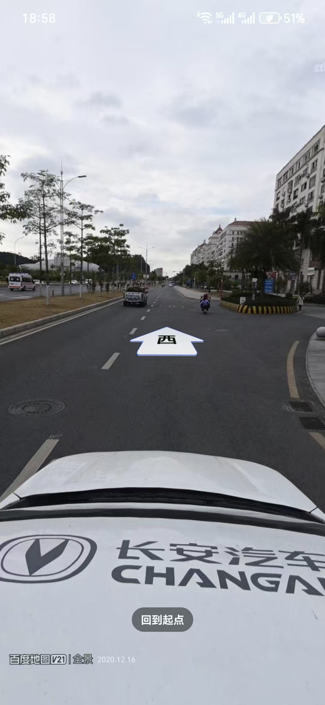
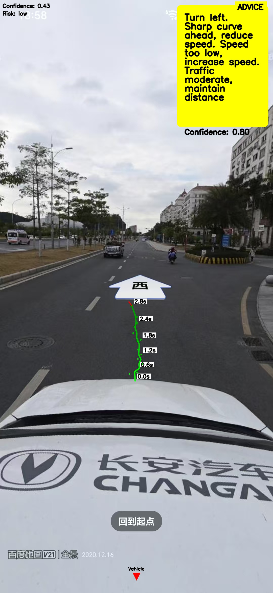

# 自动驾驶轨迹预测系统

## 项目概述

本项目实现了一个基于车载前视摄像头图像的自动驾驶轨迹预测系统，能够处理摄像头图像序列，预测车辆未来3-5秒的行驶轨迹（包含精确坐标和航向信息），并生成自然语言驾驶建议。


## 系统架构

系统采用模块化设计，包含以下核心组件：

- **输入处理**：处理摄像头图像文件夹，支持批量处理
- **图像预处理**：图像 resize、归一化、增强等操作
- **目标检测**：基于YOLOv8实现道路、车辆、行人等目标的精准检测
- **BEV生成**：将透视视图转换为鸟瞰图表示，提供更直观的场景理解
- **轨迹预测**：使用Trajectory Transformer模型预测未来轨迹
- **驾驶建议**：基于轨迹预测结果生成自然、准确的驾驶建议
- **可视化**：将轨迹和建议以直观方式展示
- **系统集成**：端到端流程集成，确保各模块协同工作

## 环境配置

### 1. 安装Python

1. 访问 [Python官网](https://www.python.org/downloads/windows/)
2. 下载Python 3.8+的Windows安装包
3. 运行安装程序，确保勾选"Add Python to PATH"
4. 完成安装后，打开命令提示符验证：
   ```bash
   python --version
   ```

### 2. 安装依赖

在项目根目录执行：

```bash
pip install -r requirements.txt
```

### 3. 准备测试数据

- 从公开数据集下载前视摄像头测试数据（如KITTI、BDD100K等）
- 将数据放置在 `data/images/` 目录

## 使用方法

### 基本用法

```bash
python src/main.py --input data/images --output output
```

### 配置选项

可通过修改 `config/config.yaml` 文件调整系统参数，包括模型参数、预测时长、可视化选项等。

## 输入输出示例

### 输入示例


### 输出示例


## 项目结构

```
autonomous-driving-trajectory-prediction/
├── data/                # 测试数据和模型
│   ├── images/          # 测试图片
├── src/                 # 源代码
│   ├── input/           # 输入处理模块
│   ├── preprocess/      # 图像预处理模块
│   ├── detection/       # 目标检测模块
│   ├── bev/             # BEV生成模块
│   ├── trajectory/      # 轨迹预测模块
│   ├── advice/          # 驾驶建议生成模块
│   ├── visualization/   # 可视化模块
│   ├── utils/           # 工具函数
│   └── main.py          # 主入口
├── config/              # 配置文件
├── output/              # 输出结果
│   ├── trajectories/    # 轨迹预测结果
│   ├── visualizations/  # 可视化结果
├── skills/              # 技能模块
├── requirements.txt     # 依赖配置
└── README.md            # 项目说明
```

## 性能指标

- **处理速度**：CPU环境下单帧处理时间 < 500ms
- **内存占用**：运行时内存消耗 < 4GB
- **轨迹预测精度**：平均位移误差(ADE) < 1.5m
- **目标检测准确率**：目标检测mAP > 85%

## 系统要求

- **操作系统**：Windows 10/11 64位
- **硬件要求**：Intel i5及以上处理器，8GB及以上内存
- **软件依赖**：所有依赖均为免费开源软件

## 故障排除

1. **Python未找到**：确保Python已安装并添加到系统PATH
2. **依赖安装失败**：尝试使用国内镜像源
   ```bash
   pip install -r requirements.txt -i https://pypi.tuna.tsinghua.edu.cn/simple
   ```
3. **模型加载失败**：确保模型文件已正确下载并放置在 `data/models/` 目录

## 智能体协作

本项目与多个专业智能体协作，共同完成自动驾驶轨迹预测系统的开发和优化：

### 1. 视觉轨迹预测Agent (vision-trajectory-agent)
- **功能**：处理车辆摄像头图像，检测物体并预测未来轨迹
- **使用场景**：端到端处理从原始图像到结构化BEV输出和轨迹预测
- **集成方式**：通过API接口调用，接收图像输入并返回轨迹预测结果

### 2. 测试与优化Agent (test-optimization-agent)
- **功能**：验证模块正确性，评估预测准确性（ADE/FDE），分析性能瓶颈
- **使用场景**：系统性能评估、模型优化、实时性能分析
- **集成方式**：定期运行性能测试，生成优化建议

### 3. 知识诊断Agent (knowledge-diagnosis-agent)
- **功能**：解决自动驾驶、轨迹预测等领域的技术问题，分析代码错误和运行时异常
- **使用场景**：技术难题解决、模型异常分析、性能优化建议
- **集成方式**：在遇到技术问题时调用，获取专业诊断和解决方案

### 4. 项目主控Agent (project-master-agent)
- **功能**：协调整个项目生命周期，分解任务，调度工作，解决跨模块数据格式不兼容问题
- **使用场景**：项目初始化、任务分配、阶段验证、最终集成测试
- **集成方式**：作为项目管理中心，协调各模块的开发和集成

### 5. 交互可视化Agent (interaction-visualizer)
- **功能**：将算法输出转换为人类可读的驾驶建议和可视化演示
- **使用场景**：轨迹可视化、驾驶建议生成、演示视频创建
- **集成方式**：接收轨迹预测结果，生成可视化输出和驾驶建议

## 技能 (Skills) 集成

项目集成了多个专业技能模块，增强系统功能：

- **PDF处理**：用于处理和分析PDF格式的文档和报告
- **DOCX处理**：用于生成和管理Word格式的报告和文档
- **PPTX处理**：用于创建项目演示和汇报材料
- **XLSX处理**：用于数据分析和结果统计
- **技能创建器**：用于创建和管理自定义技能

## 项目规则与约束

### 1. 协作规则
- **强制协作**：处理TRAE CN相关问题时，优先调用协作智能体
- **分析约束**：调用协作智能体时，必须传递核心约束，仅辅助解释问题成因
- **输出规范**：已调用协作智能体时，需标注协作结论摘要

### 2. 环境与依赖约束
- **依赖版本**：项目依赖版本为初始化阶段经开发者验证并固化的最优方案
- **环境配置**：严禁建议对依赖版本进行升级/降级、新增/删除依赖项
- **问题处理**：遇到环境/依赖问题时，停止试错，核对本地环境与配置手册一致性

## 联系方式

如有问题，请参考项目文档或联系开发团队。
